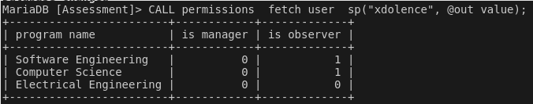

# Fetch User

## Name, Input, and Output

### **Name:** ```permissions__fetch_user__sp```

### **Input:**

- "usernameCAS" - The CAS username associated with an arbitrary user

### **Output:**

- "OUT is_super_user" - True if a super user else false

- "program_abbrev" - The abbreviation to identify a program
- "is_manager" - True if user is a manager else false
- "is_observer" - True if user is a observer else false

## Sample Output

