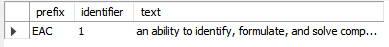

# View Outcomes in Program

## Name, Input, and Output

### **Name:** ```programs_outcomes__outcomes_in_program__sp```

### **Input:**

##### **IN Parameters**
- "abbrev" - The abbreviation of the program whose outcomes you would like to retrieve

##### **OUT Parameters**
- "status" - 0 if a valid program abbrev was specified, 1 if not
- "error_message" - NULL if the program abbrev is valid, a short description of the error if not

### **Output:**

- "prefix" - The identifying abreviation of the outcome set
- "identifier" - The specific outcome in the set that belongs to the prefix
- "text" - The outcome description

## Sample Output


