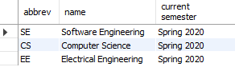

# View Current Programs

## Name and Output Fields

### **Name:** ```programs__list_current__vw```

### **Output:**

- "abbrev" - The abbreviation of the program
- "name" - The name of the program
- "current semester" - The current semester

## Sample Output

