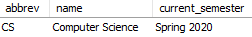

# View Program

## Name, Input, and Output

### **Name:** ```programs__list_one__sp```

### **Input:**

##### **IN Parameters**
- "abbrev" - The abbreviation of the program you would like to retrieve

##### **OUT Parameters**
- "status" - 0 if a valid program abbrev was specified, 1 if not
- "error_message" - NULL if the program abbrev is valid, a short description of the error if not

### **Output:**

- "abbrev" - The program abbreviation
- "name" - The program name
- "current_semester" - The program's current semester

## Sample Output


